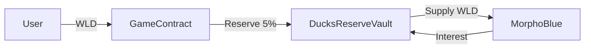

# Morpho Blue Integration Strategy for DUCKS

## Overview
Morpho Blue is a lending protocol allowing permissionless market creation. Integrating it allows the DUCKS reserve pool to earn yield on WLD instead of sitting idle.

## 1. Compatibility Check
*   **Chain:** World Chain (OP Stack). Morpho Blue must be deployed on World Chain.
*   **Asset:** WLD (Worldcoin).
*   **Oracle:** Morpho requires an Oracle (e.g., Chainlink) for WLD/USD.
*   **Irm:** Interest Rate Model (AdaptiveCurve is standard).

## 2. Integration Architecture

### The "Yield Vault" Pattern
We have defined `contracts/DucksReserveVault.sol` to handle this. It acts as a middleware between the Game Contract and Morpho.

### Flow
1.  **Deposit:** Game contract sends WLD to Vault. Admin calls `vault.supplyToMorpho(amount)`.
2.  **Withdraw:** Admin calls `vault.withdrawFromMorpho(amount)`.
3.  **Emergency:** Admin calls `vault.withdrawToAdmin(amount)` to pull funds back to the ecosystem.

## 3. Handling WLD Support
If a generic WLD market does not exist on Morpho Blue (World Chain):
1.  **Create Market:** Call `createMarket(MarketParams)` on Morpho.
    *   `loanToken`: WLD
    *   `collateralToken`: USDC (or WETH)
    *   `oracle`: WLD/USD Feed
    *   `irm`: AdaptiveCurve
    *   `lltv`: Liquidation LTV (e.g., 86%)
2.  **Seed Liquidity:** The DUCKS Reserve pool can be the first supplier.

## 4. Technical Implementation

### A. Smart Contract
See `contracts/DucksReserveVault.sol`.
*   Uses `IMorpho` interface.
*   Stores immutable `MarketParams` to save gas.
*   Implements `Ownable` for security.
*   Includes `supplyToMorpho`, `withdrawFromMorpho`, and `withdrawAllFromMorpho`.
*   **Security Feature:** `emergencyRecovery` allows the admin to pull tokens if the strategy fails or needs migration.

### B. Simulation Script
See `scripts/morpho-simulate.ts`.
*   Uses `@morpho-org/blue-sdk` types.
*   Simulates APY based on utilization rates using AdaptiveCurve logic.
*   Calculates projected earnings for the reserve pool.
*   **Parameters:**
    *   LLTV: 86% (High efficiency for WLD/USDC pair)
    *   IRM: Standard AdaptiveCurveIRM

## 5. Deployment Steps
1.  Deploy `DucksReserveVault`.
2.  Transfer existing Reserve WLD from `GameContract` to `DucksReserveVault`.
3.  Run `supplyToMorpho` via Admin multisig.
4.  Update frontend `Admin.tsx` to read stats from the Vault (optional).
